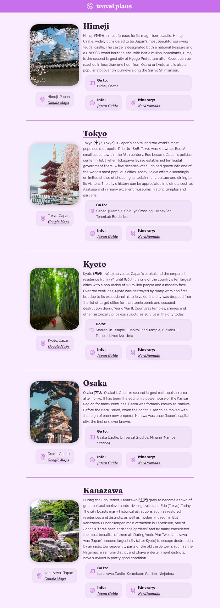

# React Travel Plans

Project made at the Learn React course at Scrimba! 🎉 I used mainly **React** for this project.

Its main goal was to learn components, props, and how to use map() to render the data.

It's a very simple page, but it was a good exercise! 😊

**Credits**:

-   Unsplash, for the images,
-   Japan Guide, for the content,
-   Phosphor-Icons for the Icons, and
-   Scrimba for the wonderful course.

## Overview

## Changelog

-   1.0 - Initial commit.
